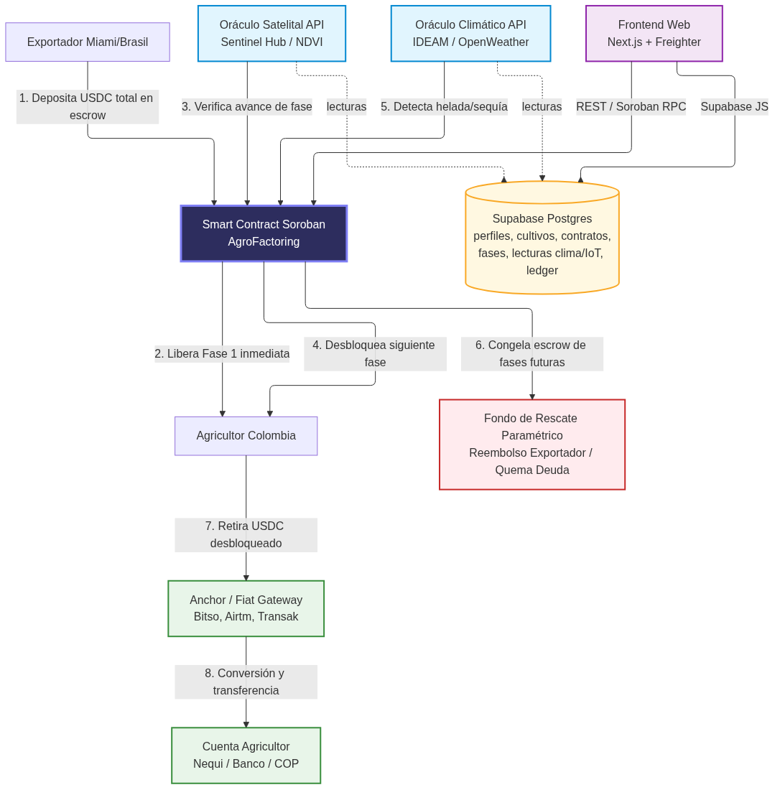
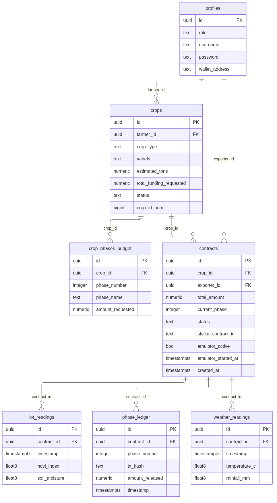
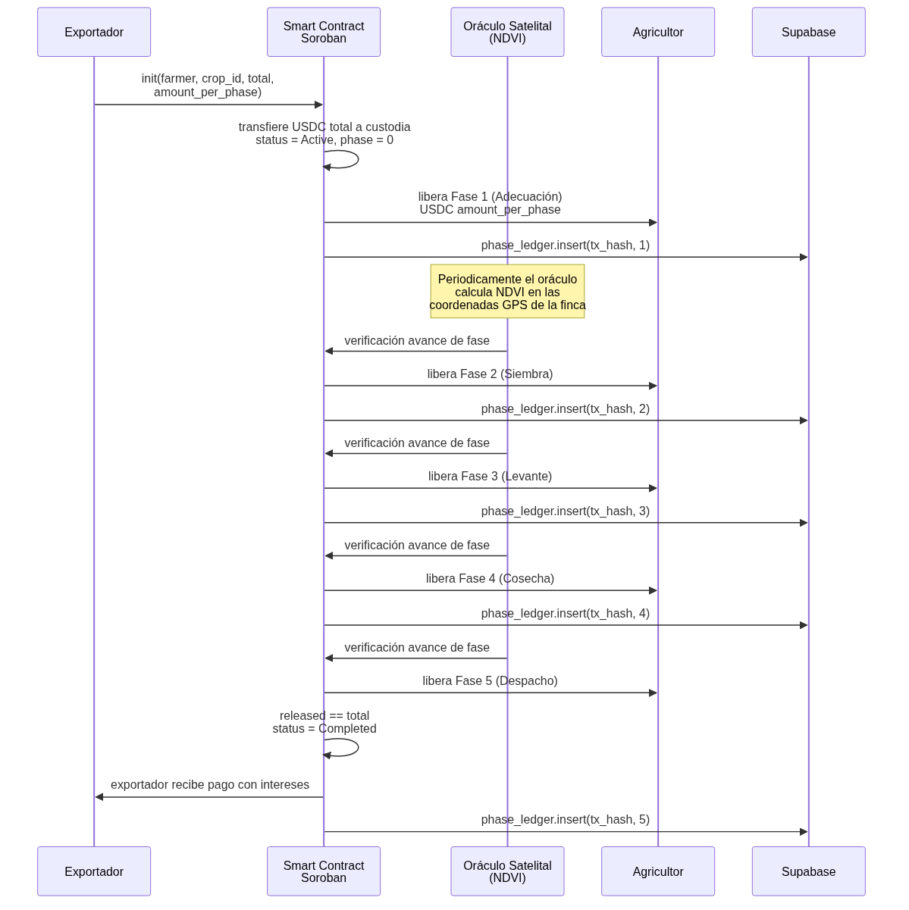
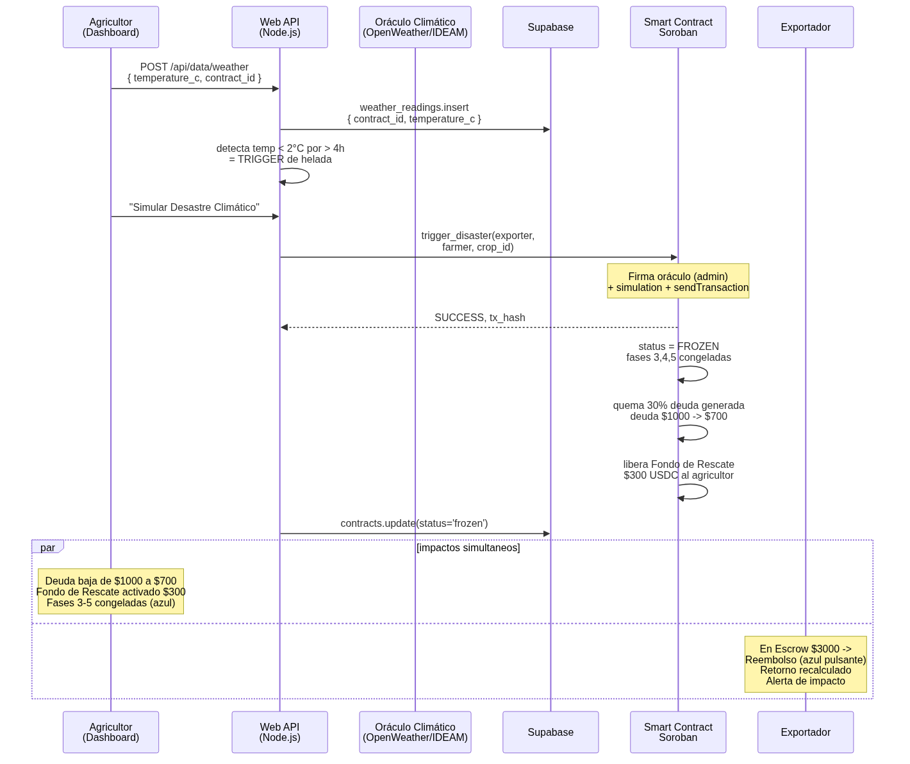

# AgroFactoring

> Factoring agrícola paramétrico por ciclo en Stellar. Un smart contract en Soroban actúa como escrow por fases del ciclo agronómico entre un exportador y un agricultor, con seguro climático: si un oráculo detecta helada o sequía, el contrato congela los fondos y redistribuye el saldo en tiempo real, sin intermediarios.

---

## 🌐 Idiomas / Languages

> **Español** (este archivo) · [English](./README.en.md)

---

## 🔑 Usuarios y claves de prueba

| Rol | Usuario | Contraseña |
|---|---|---|
| Exportador | `exportador` | `expo2024` |
| Agricultor | `agricultor` | `agro2024` |

---


---

**TL;DR (60 segundos).** El agro latinoamericano pierde miles de millones al año porque los bancos no prestan a pequeños agricultores por el riesgo climático, y cuando lo hacen mediante factoring tradicional, entregan todo el dinero de golpe sin saber si se usó correctamente. Construimos en Stellar el primer **AgroFactoring Paramétrico por Ciclo**: un exportador financia la siembra mediante un smart contract que actúa como escrow inteligente. El agricultor no recibe todo el dinero de golpe; el contrato **habilita** liquidez fase por fase del ciclo agronómico. El agricultor **retira** los USDC a su wallet Stellar cuando lo decide. Si un oráculo climático detecta helada o sequía, el contrato **congela** las fases futuras (protegiendo al exportador) y, al resolver, **redistribuye** el saldo restante: 30 % al agricultor como fondo de rescate y 70 % de reembolso al exportador. Sin intermediarios, sin ajustadores de seguros. Sensores IoT monitorean constantemente el cultivo (simulados en el MVP, físicos en producción). Liquidez inmediata y segura por código en Stellar.

---

## Tabla de contenidos

1. [¿Qué es?](#1-qu%c3%a9-es)
2. [El problema](#2-el-problema)
3. [La solución](#3-la-soluci%c3%b3n)
4. [Por qué Stellar](#4-por-qu%c3%a9-stellar)
5. [Potencial de la solución](#5-potencial-de-la-soluci%c3%b3n)
6. [Arquitectura de la solución](#6-arquitectura-de-la-soluci%c3%b3n)
7. [Smart Contract (Soroban)](#7-smart-contract-soroban)
8. [Esquema de datos (Supabase)](#8-esquema-de-datos-supabase)
9. [Flujos clave](#9-flujos-clave)
10. [Stack tecnológico](#10-stack-tecnol%c3%b3gico)
11. [Prerrequisitos](#11-prerrequisitos)
12. [Instalación y ejecución](#12-instalaci%c3%b3n-y-ejecuci%c3%b3n)
13. [Roadmap](#13-roadmap)
14. [Estado de las funcionalidades](#14-estado-de-las-funcionalidades)
15. [Licencia y créditos](#15-licencia-y-cr%c3%a9ditos)

---

## 1. ¿Qué es?

AgroFactoring es un sistema de **factoring agrícola paramétrico por ciclo** construido sobre Stellar. Un smart contract Soroban mantiene la custodia del capital (USDC) depositado por un exportador y lo **habilita** al agricultor **fase por fase**, conforme avanza el ciclo agronómico (Adecuación → Siembra → Levante → Cosecha → Despacho). El agricultor **retira** los USDC habilitados a su wallet Stellar cuando lo decida. Un oráculo de software (APIs satelitales y climáticas + dispositivos IoT que monitorean constantemente el cultivo, simulados en el MVP y físicos en producción) dispara dos eventos automáticos:

- **Verificación de fase:** el satélite confirma avance del cultivo (índice NDVI) → el contrato **habilita** el siguiente tramo de USDC para retiro.
- **Seguro paramétrico:** el oráculo climático detecta helada (`temp < 2 °C` durante más de 4 h) o sequía → el contrato **congela** el escrow de fases futuras (protegiendo al exportador). Al resolver, **redistribuye** el saldo restante: 30 % al agricultor (fondo de rescate) y 70 % al exportador (reembolso). Sin quema de tokens.

El agricultor retira los USDC directamente a su wallet Stellar. La conversión a COP vía gateway fiat (Bitso API / Anchor SEP-24) es una próxima etapa de producción.

## 2. El problema

- Los bancos latinoamericanos no prestan a pequeños agricultores porque el riesgo climático y operativo es demasiado alto.
- Los seguros tradicionales tardan ~6 meses en pagar, cuando el agricultor ya quebró.
- El exportador pierde su cadena de suministro cuando una helada destruye la cosecha.
- El factoring tradicional entrega todo el dinero de golpe, sin control sobre si el agricultor lo usa correctamente en cada etapa de la siembra.

## 3. La solución

**Factoring agrícola por fases con seguro paramétrico incrustado en Stellar.** Se elimina la contradicción de *"dinero inmediato vs. escrow"* al habilitar el capital estrictamente conforme avanza el ciclo agronómico:

1. **Onboarding y estudios previos.** El agricultor presenta un plan técnico validado: tipo de cultivo, variedad, estudios de suelo y un presupuesto desglosado por 5 fases.
2. **El escrow inteligente por fases.** El exportador deposita el USDC total en el smart contract Soroban. Solo se **habilita** el primer tramo al instante; el resto queda bloqueado en escrow.
3. **El oráculo climático/agrícola.** Un backend Node.js consume APIs públicas vinculadas a las coordenadas GPS de la finca para verificar el estado del cultivo (imágenes satelitales NDVI) y el clima (OpenWeatherMap / IDEAM). Además, **dispositivos IoT monitorean constantemente el cultivo** (humedad de suelo, NDVI local, temperatura de canopy) — en el MVP estos sensores están **simulados** por un emulador con auto-stop; en producción serán **físicos**, reportando a Edge Functions de Supabase que evalúan los umbrales paramétricos y disparan los triggers on-chain automáticamente (24/7, sin intervención humana).
4. **Los escenarios.**
   - **Éxito por fase:** el oráculo satelital confirma avance → el contrato **habilita** la siguiente fase → el agricultor **retira** los USDC a su wallet → al finalizar el Despacho el escrow pasa a `Completed` y el exportador recibe su pago con intereses.
   - **Desastre climático:** el oráculo detecta helada/sequía → el contrato **congela** el escrow de fases futuras → al resolver, **redistribuye** el saldo restante: 30 % al agricultor (rescate) y 70 % al exportador (reembolso).

## 4. Por qué Stellar

| Razón | Detalle |
|---|---|
| **USDC + EURC nativos** | El exportador en Miami paga en USDC, el comprador en Rotterdam recibe EURC, en la misma cadena donde vive el contrato. |
| **Anchors en LATAM** | Bitso (Colombia, Brasil, México), MoneyGram (Colombia), Conduit (B2B). El agricultor recibe COP en Nequi sin saber que usó blockchain. |
| **ISO 20022** | Credibilidad institucional para bancos y commodity traders europeos. |
| **SEP-24 / SEP-31** | Protocolos nativos para deposit/withdrawal fiat y pagos cross-border. |
| **Soroban** | Lógica compleja (escrow por múltiples tramos + lógica paramétrica) en Rust/WASM. Fees ~$0.003/tx. |

### Liquidación a pesos colombianos (última milla)

| Opción | Tiempo | Cómo |
|---|---|---|
| Retiro USDC on-chain (MVP actual) | instantáneo | El agricultor retira USDC del contrato a su wallet Stellar vía `withdraw`. El balance disponible = total habilitado − total retirado. |
| API exchange LATAM (producción v1) | 1 día | Backend llama Bitso o Airtm: vende USDC, envía COP vía PSE/ACH a la cuenta del agricultor. |
| Anchor Stellar nativo (escala) | meses | Asociación con corredor de cambio regulado en Colombia registrado como Anchor SEP-24; el contrato paga al Anchor y este acredita COP automáticamente. |

## 5. Potencial de la solución

- **Mercado.** El crédito rural en LATAM es un mercado de miles de millones de USD sin atender: los pequeños cafeteros colombianos son el caso de uso emblemático.
- **Ventaja competitiva.** *Sensores IoT que monitorean constantemente el cultivo* (simulados en el MVP, físicos en producción) combinados con APIs de satélite y clima, puro software. *Escrow por tramos* que protege al inversor del mal uso de fondos — algo que el factoring tradicional no hace. *Legalmente viable*: es factoring con seguro paramétrico, no un mercado de futuros (no requiere regulación CFTC).
- **Impacto real.** Resuelve acceso al crédito para pequeños agricultores evitando que se endeuden de por vida si hay una helada: el exportador no pierde su dinero futuro y el agricultor no queda en bancarrota, en segundos en lugar de meses.
- **Escalabilidad.** El mismo patrón aplica a café, cacao, arroz, maíz, frutales y cualquier cultivo con ciclo agronómico medible por NDVI. Multi-cultivo, multi-país, multi-moneda sobre la misma infraestructura Stellar.
- **Expansión geográfica.** Una vez establecidos en Colombia, nos pensamos expandir a mercados grandes como **Brasil y México**, aprovechando la misma infraestructura Stellar, los anchors de Bitso en esos países y adaptando los ciclos agronómicos locales (café, cacao, soja, maíz).
- **Modelo de negocio.** Comisión por despliegue del escrow + spread del seguro paramétrico + fee de última milla fiat. Alineación de incentivos: todos ganan si el ciclo se completa, nadie pierde todo si hay desastre.

## 6. Arquitectura de la solución



La solución se compone de cinco capas que cooperan:

1. **Capa Blockchain — Stellar / Soroban (Rust → WASM).** El smart contract `Agro_Factoring` mantiene la custodia del USDC, **habilita** liberaciones por fases (sin transferir hasta que el agricultor retire), ejecuta la congelación paramétrica y la redistribución del saldo en `resolve_disaster`. Detalle completo en [`docs/smart-contract.md`](./docs/smart-contract.md).
2. **Capa Cliente — Next.js 16 + React 19 + Tailwind v4 + Freighter.** El dashboard contextual por rol (exportador / agricultor) que firma transacciones y muestra el estado del escrow en tiempo real.
3. **Capa Oráculos — Backend Node.js.** Consume OpenWeatherMap/IDEAM (clima) y Sentinel Hub (NDVI satelital) o evidencia fotográfica georeferenciada subida desde el celular del agricultor. El oráculo firma como *admin* del contrato para los triggers paramétricos y para `withdraw` (retiros del agricultor).
4. **Capa Datos — Supabase (Postgres + Auth).** Persiste perfiles, cultivos, contratos, presupuesto por fases, el *ledger* de tx hashes on-chain, los retiros del agricultor y las lecturas meteorológicas/IoT. Detalle completo en [`docs/database.md`](./docs/database.md).
5. **Capa Fiat — última milla.** Retiro USDC on-chain directo a la wallet del agricultor (MVP actual); Bitso API (producción v1) / Anchor SEP-24 (escala) para convertir USDC → COP.

El diagrama de componentes completo está en [`docs/architecture.md`](./docs/architecture.md).

## 7. Smart Contract (Soroban)

El contrato `Agro_Factoring` está en [`Stellar/contracts/Agro_Factoring/src/lib.rs`](./Stellar/contracts/Agro_Factoring/src/lib.rs) y expone **nueve funciones**:

| Función | Quién llama | Qué hace |
|---|---|---|
| `__constructor(admin)` | deploy | Fija el admin/oráculo del contrato (instance storage). |
| `set_usdc(usdc_address)` | admin | Registra la dirección del contrato USDC usado en todos los transfer. |
| `init(exporter, farmer, crop_id, total, per_phase)` | exportador | Transfiere el USDC total a custodia del contrato y crea el escrow en estado `Active`, `current_phase = 0`. |
| `release_phase(crop_id, phase_number)` | exportador | **Habilita** un tramo para retiro (no transfiere USDC) en orden estricto ascendente; al habilitar la última fase el escrow pasa a `Completed`. |
| `withdraw(crop_id, amount)` | admin/oráculo | Transfiere USDC del contrato al agricultor (hasta `released_amount - withdrawn_amount`). |
| `trigger_disaster(exporter, farmer, crop_id)` | admin/oráculo | Congela el escrow: estado `Frozen`, sin más habilitaciones. |
| `resolve_disaster(crop_id, rescue_bps)` | admin/oráculo | Redistribuye el saldo restante: `rescue_bps`% al agricultor (rescate) y el resto al exportador (reembolso). Elimina el escrow. |
| `reset_escrow(crop_id)` | admin/oráculo | Devuelve el saldo restante (`total_amount - withdrawn_amount`) al exportador y elimina el escrow. |
| `get_escrow_state(exporter, farmer, crop_id)` | partes | Lector de estado (requiere que las partes coincidan). |

El `EscrowData` trackea dos contadores independientes: `released_amount` (USDC habilitado para retiro) y `withdrawn_amount` (USDC efectivamente retirado por el agricultor). El balance disponible para retiro = `released_amount - withdrawn_amount`.

Estados del escrow (enum `EscrowStatus`): `Active` → `Completed` (éxito) o `Active` → `Frozen` (desastre). `Frozen` no es terminal: el agricultor puede retirar fondos ya habilitados, y `resolve_disaster`/`reset_escrow` pueden actuar sobre un escrow congelado. La gestión de TTL (~30 días) evita el archivado. Diagrama de máquina de estados:


Referencia técnica completa (tipos, storage keys, errores, TTL) en [`docs/smart-contract.md`](./docs/smart-contract.md).

## 8. Esquema de datos (Supabase)



**Ocho tablas** coordinan el estado *off-chain* que complementa al estado on-chain:

| Tabla | Propósito |
|---|---|
| `profiles` | Usuarios (exportador/agricultor) con `wallet_address` y credenciales de prueba (auth con `jose`/JWT). |
| `crops` | Catálogo de cultivos (tipo, variedad, toneladas, financiamiento solicitado, `status`, `crop_id_num` mapea al on-chain). |
| `crop_phases_budget` | Presupuesto desglosado por las 5 fases agronómicas. |
| `contracts` | Instancia del escrow on-chain: mapea a `crop_id`, `exporter_id`, `total_amount`, `current_phase`, `status`, `stellar_contract_id`, flags del emulador. |
| `phase_ledger` | Auditoría: cada `release_phase` registra `tx_hash`, `phase_number`, `amount_released` (monto **habilitado**, no transferido). El rescate de `resolve_disaster` se registra con `phase_number = 0`. |
| `withdrawals` | Retiros del agricultor: cada `withdraw` registra `amount`, `bank_name`, `account_last4`, `tx_hash`, `status` (`completed`/`failed`). |
| `weather_readings` | Lecturas de temperatura y precipitación alimentadas por el oráculo climático. |
| `iot_readings` | Reservada para lecturas de sensores IoT (NDVI in situ, humedad de suelo). |

Detalle completo, migraciones y notas de seguridad en [`docs/database.md`](./docs/database.md).

## 9. Flujos clave

### Escenario A — Éxito por fase (habilitación + retiro progresivo)



El exportador deposita el total → el contrato **habilita** la fase 1 → el oráculo satelital confirma el NDVI de cada fase → el contrato habilita la siguiente → el agricultor **retira** los USDC a su wallet cuando lo decida → al habilitar la última fase el escrow pasa a `Completed`. Cada `release_phase` queda registrado en `phase_ledger` con su `tx_hash`; cada `withdraw` queda en `withdrawals` con su `tx_hash`.

### Escenario B — Desastre climático (el "wow moment")



El agricultor pulsa "Simular Desastre Climático" → el oráculo (admin) firma y envía `trigger_disaster` on-chain → el contrato **congela** las fases futuras (protegiendo el saldo del exportador) → el agricultor aún puede retirar lo ya habilitado → al pulsar "Resolver Desastre", el oráculo firma `resolve_disaster` con `rescue_bps=3000` → el contrato **redistribuye** el saldo restante: **30 % al agricultor** (fondo de rescate) y **70 % al exportador** (reembolso). Sin quema de tokens. El impacto es simultáneo en ambas vistas (exportador y agricultor).

> *Sin blockchain, esto requiere 6 meses de papeleo y el agricultor pierde todo. Aquí el exportador no pierde su dinero futuro y el agricultor no queda en bancarrota — en 3 segundos.*

Los scripts Mermaid editables de todos los diagramas están en [`docs/diagrams.md`](./docs/diagrams.md).

## 10. Stack tecnológico

| Componente | Tecnología |
|---|---|
| Smart contract | Soroban (Rust/WASM) — lógica de estado por fases + retiro + redistribución |
| Frontend | React 19 + Next.js 16 (App Router) + Tailwind v4 + Freighter wallet |
| Backend / oráculos | Node.js — integra OpenWeatherMap, IDEAM, Sentinel Hub (NDVI) |
| Cliente Soroban | `@stellar/stellar-sdk` 16 (RPC + `TransactionBuilder` + `assembleTransaction`) |
| Autenticación | `jose` (JWT) sobre Supabase |
| Base de datos | Supabase (Postgres + Auth) |
| Stablecoin | USDC en Stellar testnet |
| Retiro de USDC | Transferencia on-chain del contrato a la wallet del agricultor (MVP); Bitso API (prod v1); Anchor SEP-24 (escala) |
| Red | Stellar testnet (hackathon) / mainnet (prod) |

## 11. Prerrequisitos

- **Rust** (stable) + target `wasm32-unknown-unknown` y **`stellar-cli`** (con `soroban-cli`) para compilar, probar y desplegar el contrato.
- **Node.js 20+** y **npm** para el frontend (la SDK de Stellar exige Node ≥ 20).
- Una cuenta en **Stellar testnet** fondeada vía Friendbot, con un trustline a USDC testnet para el exportador, el agricultor y el oráculo.
- Un proyecto en **Supabase** (URL + anon key) con las migraciones aplicadas (ver sección 12).
- **Freighter** (extensión de navegador) configurado en Testnet para firmar como exportador.
- Opcional: claves de API para OpenWeatherMap y Sentinel Hub en producción.

## 12. Instalación y ejecución

### 12.1 Smart contract (Soroban)

```bash
# desde la raíz del repo
cd Stellar

# compilar el WASM optimizado
stellar contract build
# -> target/wasm32v1-none/release/Agro_Factoring.wasm

# ejecutar los tests (47 tests con snapshots)
cargo test

# generar identidad de testnet y fondear
stellar keys generate --global oracle --network testnet --fund

# desplegar el contrato
stellar contract deploy \
  --wasm target/wasm32v1-none/release/Agro_Factoring.wasm \
  --source oracle \
  --network testnet \
  -- \
  --admin <dirección-pública-del-oráculo>

# configurar la dirección del USDC testnet
stellar contract invoke \
  --id <CONTRACT_ID> \
  --source oracle \
  --network testnet \
  -- \
  set_usdc \
  --usdc_address <USDC_TESTNET_CONTRACT_ID>

# inicializar un escrow de ejemplo (5000 USDC, 1000 por fase)
stellar contract invoke \
  --id <CONTRACT_ID> \
  --source <exportador> \
  --network testnet \
  -- \
  init \
  --exporter <exportador> --farmer <agricultor> \
  --crop_id 1 --total_amount 5000000000 --amount_per_phase 1000000000

# habilitar la fase 1 (no transfiere USDC, solo habilita para retiro)
stellar contract invoke \
  --id <CONTRACT_ID> \
  --source <exportador> \
  --network testnet \
  -- \
  release_phase --crop_id 1 --phase_number 1

# el agricultor retira 500 USDC del contrato a su wallet
stellar contract invoke \
  --id <CONTRACT_ID> \
  --source oracle \
  --network testnet \
  -- \
  withdraw --crop_id 1 --amount 5000000000
```

> Las unidades de USDC usan 7 decimales en Stellar, por eso `5000 USDC` = `5000000000` stroops. Los 47 tests bajo `Stellar/contracts/Agro_Factoring/test_snapshots/` documentan el comportamiento esperado de `init`, `release_phase`, `withdraw`, `trigger_disaster`, `resolve_disaster` y `reset_escrow` (escritura por `cargo test`, difs auditables).

### 12.2 Backend / Oráculos y Web (Next.js)

```bash
# desde la raíz del repo
cd web
cp .env.example .env
# completar .env con:
#   NEXT_PUBLIC_SUPABASE_URL, NEXT_PUBLIC_SUPABASE_ANON_KEY
#   NEXT_PUBLIC_STELLAR_CONTRACT_ID, NEXT_STELLAR_SECRET_KEY (oráculo)
#   NEXT_STELLAR_USDC_CONTRACT_ID (contrato SAC USDC testnet)
#   NEXT_PUBLIC_STELLAR_RPC_URL (RPC Soroban; por defecto testnet)
#   NEXT_PUBLIC_EXPORTER_PUBLIC_KEY, NEXT_PUBLIC_FARMER_PUBLIC_KEY
#   SUPER_SECRET_KEY (32 bytes hex para firmar JWT)

npm install
npm run dev
# -> http://localhost:3000
```

### 12.3 Supabase (esquema + seed)

Las migraciones ya están aplicadas en el proyecto Supabase vinculado (10 migraciones listadas en [`docs/database.md`](./docs/database.md)). Para reproducir el esquema en un proyecto nuevo, aplica las migraciones en orden desde el panel de Supabase o con la CLI `supabase db push`. El seed de demo incluye un cultivo (Café Caturra en Salento, Quindío), su presupuesto por 5 fases y el contrato demo.

## 13. Roadmap

### Etapa actual — MVP del hackathon (oráculos por API)

- Smart contract Soroban operativo en testnet con **9 funciones**: `__constructor`, `set_usdc`, `init`, `release_phase`, `withdraw`, `trigger_disaster`, `resolve_disaster`, `reset_escrow`, `get_escrow_state`. **47 tests** (36 originales + 11 de `withdraw`).
- `release_phase` **habilita** USDC para retiro (no transfiere); `withdraw` transfiere del contrato al agricultor.
- `resolve_disaster` **redistribuye** el saldo restante (30 % rescate / 70 % reembolso), sin quema de tokens.
- Oráculo climático por **API** (OpenWeatherMap / IDEAM Colombia): detección de helada (`temp < 2 °C` > 4 h). Lecturas persistidas en `weather_readings`.
- Verificación de fase por **API satelital** (Sentinel Hub NDVI) o evidencia fotográfica georeferenciada.
- Dashboard contextual por rol (exportador / agricultor) con el "wow moment" del desastre climático.
- Retiro de USDC on-chain del contrato a la wallet del agricultor; ledger de tx hashes en Supabase (`phase_ledger` + `withdrawals`).
- **8 tablas** en Supabase + **10 migraciones** aplicadas.

### Próxima etapa — Datos meteorológicos reales + IoT real

La siguiente fase incorpora **datos meteorológicos en tiempo real** desde estaciones oficiales y sensores IoT físicos desplegados en la finca, complementando las APIs remotas con mediciones *in situ* (humedad de suelo, NDVI local, temperatura de canopy). Cada finca tendrá su(s) dispositivo(es) IoT reportando a Edge Functions de Supabase, que evalúan los umbrales paramétricos y disparan los triggers on-chain automáticamente — eliminando la intervención del botón "Simular" del MVP y reemplazándola por detección autónoma 24/7. La tabla `iot_readings` ya está reservada en el esquema para este propósito. Detalle completo de la hoja de ruta (incluyendo anchor SEP-24 nativo y mainnet) en [`docs/roadmap.md`](./docs/roadmap.md).

### Expansión geográfica — Brasil y México

Una vez establecidos y validados en Colombia, nos pensamos expandir a mercados grandes como **Brasil y México**, aprovechando la misma infraestructura Stellar, los anchors de Bitso en esos países y adaptando los ciclos agronómicos locales (café, cacao, soja, maíz). El patrón multi-cultivo, multi-país y multi-moneda sobre la misma blockchain es la ventaja estructural del diseño.

## 14. Estado de las funcionalidades

Todas las funcionalidades descritas en este documento están **implementadas y operativas**: el smart contract compila (9 funciones, 47 tests), se despliega en Stellar testnet; el frontend firma y envía transacciones reales on-chain mediante `@stellar/stellar-sdk` 16; el esquema Supabase está aplicado (8 tablas, 10 migraciones) con datos de demo cargados; el oráculo firma como admin y el emulador inserta lecturas meteorológicas con auto-stop; el retiro de USDC del contrato a la wallet del agricultor es real y on-chain. El MVP del hackathon cumple los flujos end-to-end de habilitación por fase, retiro, desastre climático y redistribución. Los aspectos pendientes para Hardening/producción (RLS de Supabase, hash de contraseñas, anchor SEP-24 nativo, sensores IoT físicos) se documentan puntualmente en [`docs/database.md`](./docs/database.md) y [`docs/roadmap.md`](./docs/roadmap.md).

## 15. Licencia y créditos

Licencia MIT. Construido para un hackathon sobre Stellar / Soroban, Next.js y Supabase. Diagramas generados con Mermaid (fuentes `.mmd` y PNG en `docs/images/`).
