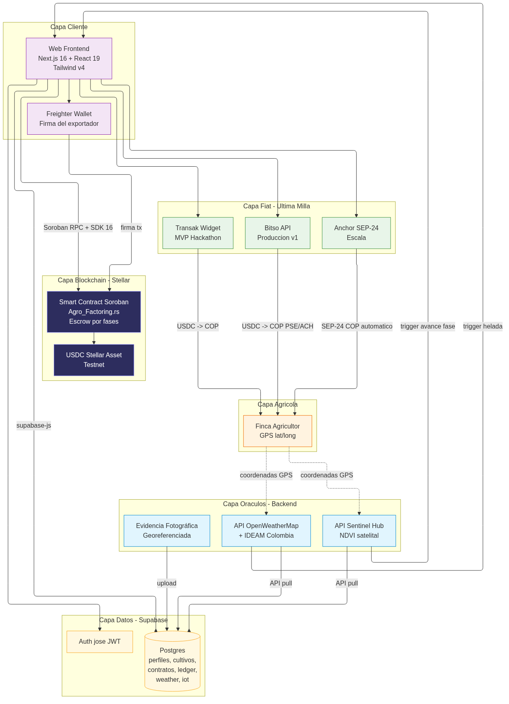

# Arquitectura de la solución

> Volver a: [README](../README.md) · Ver también: [Smart Contract](./smart-contract.md) · [Base de datos](./database.md) · [Diagramas](./diagrams.md)

AgroFactoring divide la complejidad en cinco capas que cooperan. Esta página describe cada capa y su interacción; el diagrama de componentes reúne todo en una sola vista.

---

## 1. Capa Blockchain — Stellar / Soroban

- **Smart contract:** `Agro_Factoring` (Rust → WASM) en [`../Stellar/contracts/Agro_Factoring/src/lib.rs`](../Stellar/contracts/Agro_Factoring/src/lib.rs).
- **Modelo host-guest Soroban:** el contrato es código WASM sandboxed que opera sobre el *Host Environment* de Stellar (storage, crypto, llamadas cross-contract). Sin `std`, sin `delegatecall`, sin reentrancy clásica.
- **Custodia de USDC:** el contrato toma custodia total del USDC en `init` (vía `TokenClient::transfer` del Stellar Asset Contract). `release_phase` **habilita** montos para retiro (sin transferir); `withdraw` transfiere del contrato al agricultor; `resolve_disaster` redistribuye el saldo restante (30 % rescate / 70 % reembolso). El USDC es un *Stellar Asset* expuesto a Soroban a través del SAC.
- **Autorización explícita:** `require_auth()` valida que el exportador firme `init`/`release_phase` y que el admin/oráculo firme `withdraw`, `trigger_disaster`, `resolve_disaster`, `reset_escrow` y `set_usdc`.
- **Almacenamiento:** `instance` para admin/USDC (config global); `persistent` para cada escrow por `crop_id` (sobrevive archivado, TTL extendido a ~30 días).
- Detalle técnico: [`./smart-contract.md`](./smart-contract.md).

## 2. Capa Cliente — Next.js 16 + React 19 + Tailwind v4

- **App Router** de Next con rutas de API (Node.js runtime) que actúan como backend/oráculo.
- **`@stellar/stellar-sdk` 16** se encarga del cliente Soroban RPC: `rpc.Server`, `TransactionBuilder`, `rpc.simulateTransaction`, `rpc.assembleTransaction`, `rpc.sendTransaction` y el *polling* de confirmación (`rpc.getTransaction`). Ver [`../web/lib/stellar.ts`](../web/lib/stellar.ts) y [`../web/app/api/contract/trigger-disaster/route.ts`](../web/app/api/contract/trigger-disaster/route.ts).
- **Freighter wallet** como firmante del exportador (la extensión exige Node 20+ que coincide con la SDK 16).
- **Dashboard contextual por rol** (exportador / agricultor) con botón *Switch Rol* y el "wow moment" del desastre climático.
- **Tailwind v4** + PostCSS para los estilos; React 19 para el render.

## 3. Capa Oráculos — Backend Node.js

Tres fuentes, todas por software (sensores IoT simulados en el MVP, físicos en producción):

| Oráculo | Qué mide | Trigger |
|---|---|---|
| **OpenWeatherMap / IDEAM** | temperatura y precipitación por coordenadas GPS de la finca | helada: `temp < 2 °C` durante > 4 h; sequía: ausencia de precipitación prolongada |
| **Sentinel Hub (NDVI)** | índice de vegetación por satélite en las coordenadas exactas | incremento de cobertura vegetal valida avance de fase |
| **Evidencia fotográfica georeferenciada** | fotos del cultivo subidas desde el celular del agricultor | respaldo del NDVI |

El oráculo (admin del contrato) firma y envía `trigger_disaster` on-chain cuando se detecta el umbral paramétrico. También firma `withdraw` (retiros del agricultor), `resolve_disaster` (redistribución) y `reset_escrow` (reiniciar el escrow). Las lecturas se persisten en `weather_readings` e `iot_readings` para auditoría. Ver [`../web/app/api/data/weather/route.ts`](../web/app/api/data/weather/route.ts) y [`../web/app/api/data/iot/route.ts`](../web/app/api/data/iot/route.ts).

## 4. Capa Datos — Supabase (Postgres + Auth)

- **Postgres** persiste perfiles, cultivos, presupuesto por fases, el escrow off-chain, el *ledger* de tx hashes, los retiros del agricultor y las lecturas de los oráculos (8 tablas, 10 migraciones).
- **Auth con `jose` (JWT)** sobre las rutas `/api/auth/login` y `/api/auth/logout`; el cliente `supabase-js` con `persistSession: false` (ver [`../web/lib/supabase.ts`](../web/lib/supabase.ts)).
- **Emulador con auto-stop** (`lib/emulator.ts`) que vence las sesiones de captura de datos del hackathon tras 30 minutos.
- Detalle técnico: [`./database.md`](./database.md).

## 5. Capa Fiat — última milla

El agricultor retira los USDC directamente a su wallet Stellar. Tres opciones progresivas para la conversión a COP:

1. **Retiro USDC on-chain** (MVP actual) — el agricultor retira USDC del contrato a su wallet Stellar vía `withdraw`. El balance disponible = total habilitado − total retirado. Sin intermediarios.
2. **API de Bitso o Airtm** (producción v1) — backend vende USDC y envía COP vía PSE/ACH.
3. **Anchor SEP-24 nativo** (escala) — asociación con corredor de cambio regulado en Colombia; el contrato paga al Anchor y este acredita COP automáticamente.

---

## Interacción entre capas

Para una habilitación de fase + retiro, el flujo es:

1. El exportador firma `release_phase` en Freighter → `lib/stellar.ts` construye la tx → `rpc.simulateTransaction` → `rpc.assembleTransaction` → firma → `rpc.sendTransaction` → polling de confirmación → `tx_hash`.
2. El backend persiste `(contract_id, phase_number, tx_hash, amount_released)` en `phase_ledger`. **No transfiere USDC al agricultor**: solo habilita el monto para retiro.
3. El agricultor pulsa "Retirar" en el dashboard → el backend (oráculo) firma `withdraw` on-chain → transfiere USDC del contrato al agricultor → persista `(contract_id, amount, tx_hash, ...)` en `withdrawals`.
4. El dashboard consulta `phase_ledger` + `withdrawals` y actualiza el balance disponible.

Para un desastre, el oráculo (admin) ejecuta el mismo patrón pero invocando `trigger_disaster` (congela) y luego `resolve_disaster` (redistribuye 30/70 del saldo restante). El "wow moment" del frontend anima la transición.

Las fuentes Mermaid editables de todos los diagramas viven en [`./diagrams.md`](./diagrams.md) y los PNG renderizados en [`./images/`](./images/).
