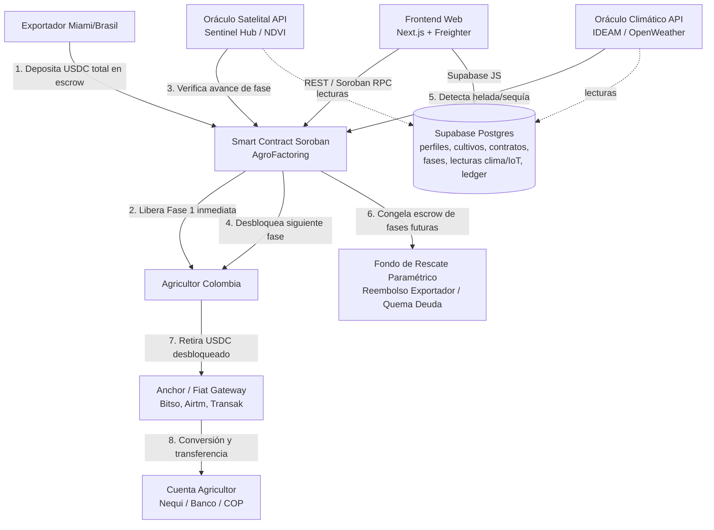
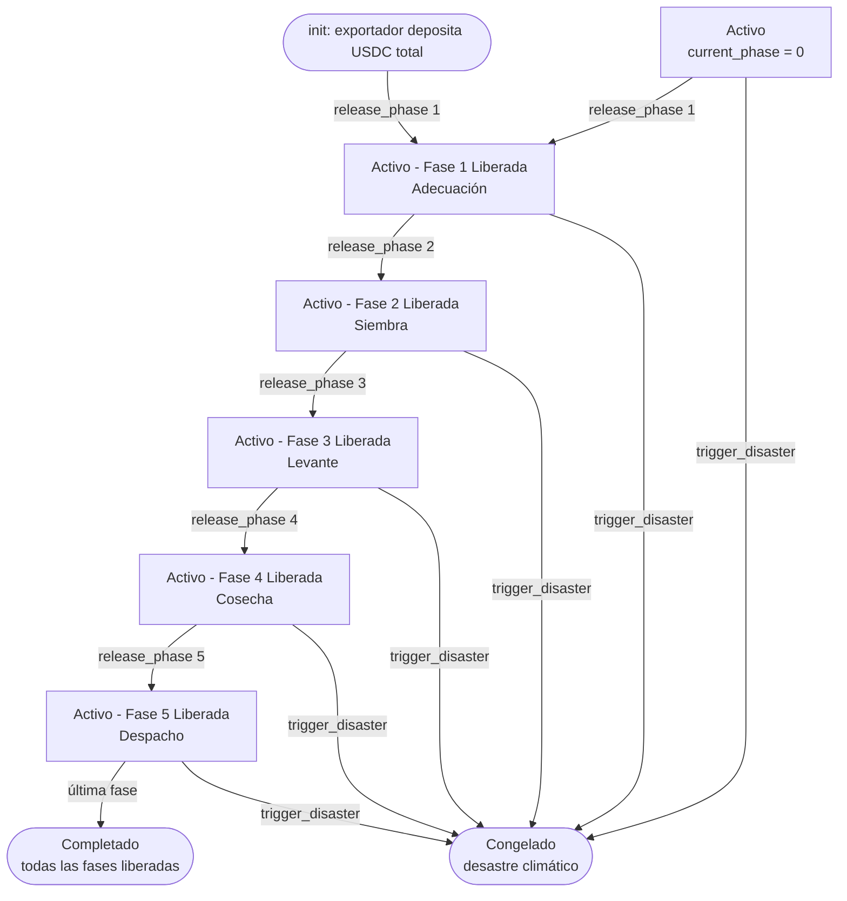
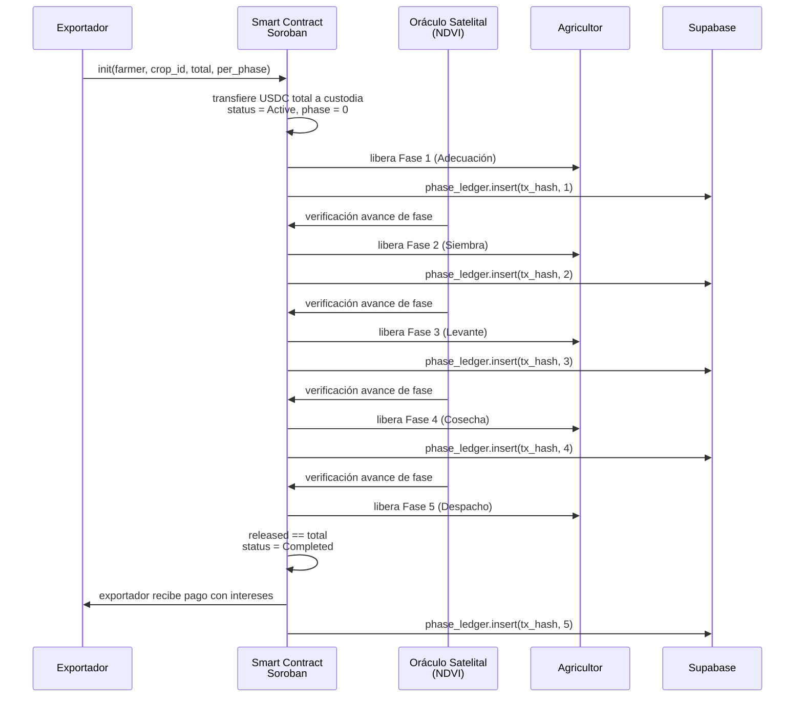
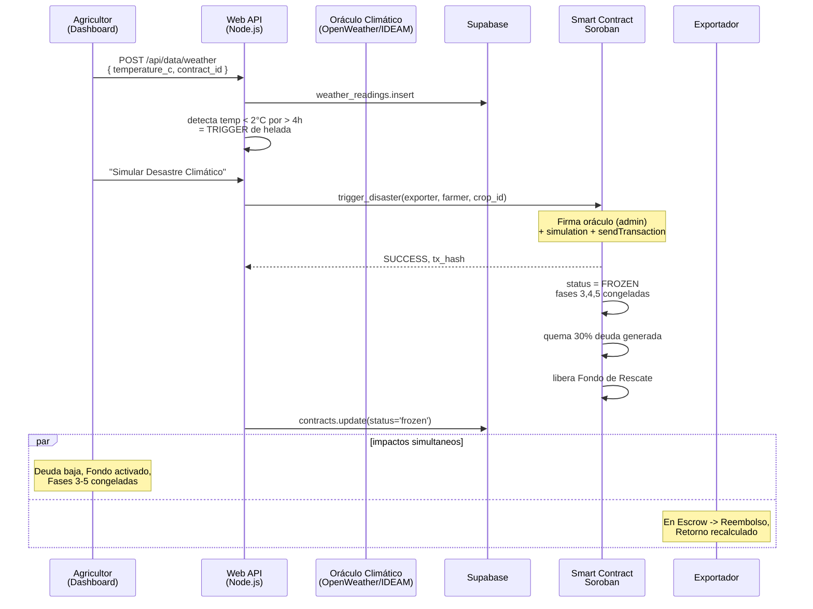
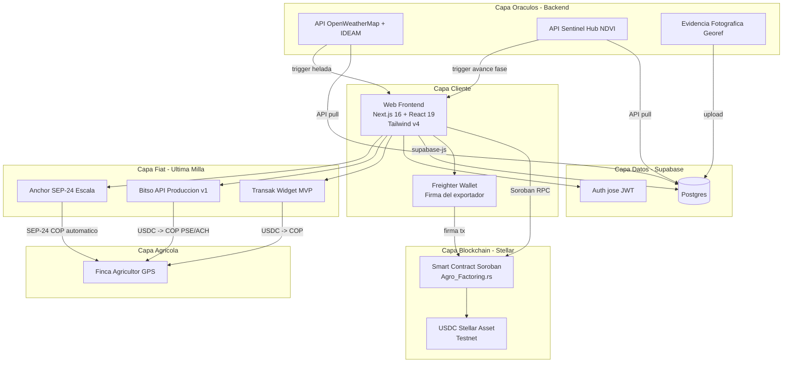

# Diagramas (fuentes Mermaid)

> Volver a: [README](../README.md) · Las imágenes renderizadas (`.png`) viven en [`./images/`](./images/); aquí están los **scripts `.mmd`** editables.

Para regenerar una imagen, instala `@mermaid-js/mermaid-cli` y ejecuta:

```bash
npm install -g @mermaid-js/mermaid-cli
# si chromium no descarga: export PUPPETEER_SKIP_DOWNLOAD=true
#   y apunta a un chrome-headless-shell existente con PUPPETEER_EXECUTABLE_PATH=...
mmdc -i images/<nombre>.mmd -o images/<nombre>.png -b transparent -w 1600
```

> Alternativa online: pega el contenido del `.mmd` en https://mermaid.live y exporta como PNG/SVG.

---

## 1. Arquitectura de alto nivel — `architecture.mmd` → `architecture.png`



## 2. Máquina de estados del escrow — `escrow-state-machine.mmd` → `escrow-state-machine.png`



## 3. Flujo de liberación por fase — `flow-release-phase.mmd` → `flow-release-phase.png`



## 4. Flujo de desastre climático — `flow-disaster.mmd` → `flow-disaster.png`



## 5. Diagrama entidad-relación — `er-diagram.mmd` → `er-diagram.png`

```mermaid
erDiagram
    profiles ||--o{ crops : "farmer_id"
    profiles ||--o{ contracts : "exporter_id"
    crops ||--o{ contracts : "crop_id"
    crops ||--o{ crop_phases_budget : "crop_id"
    contracts ||--o{ phase_ledger : "contract_id"
    contracts ||--o{ weather_readings : "contract_id"
    contracts ||--o{ iot_readings : "contract_id"

    profiles { uuid id PK; text role; text username; text password; text wallet_address }
    crops { uuid id PK; uuid farmer_id FK; text crop_type; text variety; numeric estimated_tons; numeric total_funding_requested; text status; bigint crop_id_num }
    crop_phases_budget { uuid id PK; uuid crop_id FK; integer phase_number; text phase_name; numeric amount_requested }
    contracts { uuid id PK; uuid crop_id FK; uuid exporter_id FK; numeric total_amount; integer current_phase; text status; text stellar_contract_id; bool emulator_active }
    phase_ledger { uuid id PK; uuid contract_id FK; integer phase_number; text tx_hash; numeric amount_released; timestamptz timestamp }
    weather_readings { uuid id PK; uuid contract_id FK; timestamptz timestamp; float8 temperature_c; float8 rainfall_mm }
    iot_readings { uuid id PK; uuid contract_id FK; timestamptz timestamp; float8 ndvi_index; float8 soil_moisture }
```

## 6. Diagrama de componentes — `components.mmd` → `components.png`



---

Los archivos `.mmd` fuente (con `config: layout: elk`) están en [`./images/`](./images/) junto a sus PNGs renderizados.