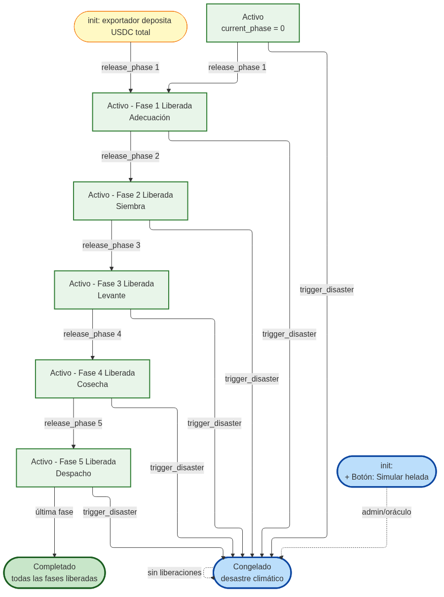

# Smart Contract (Soroban)

> Volver a: [README](../README.md) · Ver también: [Arquitectura](./architecture.md) · Fuente: [`../Stellar/contracts/Agro_Factoring/src/lib.rs`](../Stellar/contracts/Agro_Factoring/src/lib.rs)

El contrato `Agro_Factoring` es la fuente de verdad on-chain del escrow por fases. Está escrito en Rust con `soroban-sdk` 26, compila a WASM y se ejecuta en el entorno Soroban de Stellar.



---

## 1. Estados del ciclo de vida (enum `EscrowStatus`)

| Estado | Significado | Transiciones permitidas |
|---|---|---|
| `Active` | El escrow está operativo; se pueden liberar fases. | → `Active` (siguiente fase), `Completed`, `Frozen` |
| `Completed` | Todas las fases liberadas; el exportador recibió de vuelta su pago con intereses. | (terminal) |
| `Frozen` | El oráculo/admin declaró desastre; no se liberan más fondos. | (terminal) |

---

## 2. Estructura de datos (`EscrowData`)

```rust
pub struct EscrowData {
    pub exporter: Address,        // funder que deposita el USDC
    pub farmer: Address,          // beneficiario que recibe los pagos por fase
    pub crop_id: u64,             // identificador off-chain del cultivo
    pub total_amount: i128,       // USDC total depositado por adelantado
    pub current_phase: u32,       // última fase liberada (0 = ninguna aún)
    pub amount_per_phase: i128,   // USDC liberado en cada fase
    pub released_amount: i128,    // USDC acumulado liberado al agricultor
    pub status: EscrowStatus,     // estado del ciclo de vida
    pub usdc_address: Address,    // contrato USDC usado para los transfer
}
```

Cada escrow se almacena en *persistent storage* bajo la clave `DataKey::Escrow(crop_id)`, de modo que sobrevive al archivado y se mantiene con TTL extendido.

## 3. Storage keys (enum `DataKey`)

| Key | Tipo de almacenamiento | Contenido |
|---|---|---|
| `Admin` | instance | Dirección del admin/oráculo fijada en el constructor. |
| `Usdc` | instance | Dirección del contrato USDC fijada con `set_usdc`. |
| `Escrow(u64)` | persistent | El `EscrowData` de cada cultivo, indexado por `crop_id`. |

## 4. Funciones expuestas

### `__constructor(env, admin)`
Se ejecuta una sola vez al desplegar. Fija el admin/oráculo en instance storage. Aprovecha el patrón constructor de Protocol 22+, evitando una tx de `initialize` separada y el riesgo de *front-running* de inicialización.

### `set_usdc(env, usdc_address) -> Result<(), ContractError>`
Requiere `admin.require_auth()`. Registra la dirección del contrato USDC. Debe llamarse una vez antes de cualquier `init`.

### `init(env, exporter, farmer, crop_id, total_amount, amount_per_phase) -> Result<(), ContractError>`
- Requiere `exporter.require_auth()` (el exportador firma el depósito).
- Valida `total_amount > 0`, `amount_per_phase > 0` y `total_amount % amount_per_phase == 0` (montos parejos por fase).
- Rechaza re-inicialización con `AlreadyInitialized` si ya existe la clave para ese `crop_id`.
- Usa `TokenClient::new(&env, &usdc_address).transfer(&exporter, &env.current_contract_address(), &total_amount)` para tomar custodia total del USDC.
- Persiste el escrow en `Active`, `current_phase = 0`, `released_amount = 0`, y extiende el TTL.

### `release_phase(env, crop_id, phase_number) -> Result<(), ContractError>`
- Solo el exportador (`escrow.exporter.require_auth()`).
- Bloquea si `status == Frozen` (`EscrowFrozen`) o `status == Completed` (`InvalidPhase`).
- Exige orden estricto ascendente: `phase_number == current_phase + 1` (con `checked_add` para evitar overflow).
- Verifica `phase_number <= total_amount / amount_per_phase`.
- Transfiere `amount_per_phase` USDC del contrato al agricultor.
- Si `released_amount == total_amount`, el estado pasa a `Completed`.
- Refresca TTL del escrow.

### `trigger_disaster(env, exporter, farmer, crop_id) -> Result<(), ContractError>`
- Solo el admin/oráculo (`require_admin`).
- Valida que `exporter` y `farmer` coincidan con los del escrow (`PartyMismatch` si no).
- Pone `status = Frozen` y persiste. No mueve fondos: el escrow simplemente queda no-liberable. La lógica de "quemar 30 % de deuda" y "liberar fondo de rescate" se orquesta off-chain sobre los saldos liberados/congelados.

### `get_escrow_state(env, exporter, farmer, crop_id) -> Result<EscrowData, ContractError>`
Lector de solo lectura que devuelve el `EscrowData` completo. Requiere que las partes coincidan, de modo que un tercero arbitrario no puede inspeccionar escrows ajenos.

## 5. Errores (`ContractError`)

| Código | Nombre | Cuándo |
|---|---|---|
| 1 | `NotInitialized` | No hay admin configurado (constructor no corrido). |
| 2 | `AlreadyInitialized` | Ya existe un escrow para ese `crop_id`. |
| 3 | `Unauthorized` | El caller no es el admin/exportador requerido. |
| 4 | `EscrowNotFound` | No hay escrow bajo ese `crop_id`. |
| 5 | `InvalidAmount` | Monto ≤ 0, no divisible, o desbordaría el acumulado. |
| 6 | `EscrowFrozen` | Operación bloqueada porque el escrow está `Frozen`. |
| 7 | `InvalidPhase` | Número de fase fuera de orden o fuera de rango. |
| 8 | `UsdcNotConfigured` | No se llamó `set_usdc` aún. |
| 9 | `PartyMismatch` | `exporter`/`farmer` no coinciden con el escrow almacenado. |

## 6. Gestión de TTL (anti-archivado)

```rust
const TTL_THRESHOLD: u32 = 100;       // ~8 minutos (ledgers de 5 s)
const TTL_EXTEND_TO: u32 = 518400;    // ~30 días
```

Cada acceso mutador (`init`, `release_phase`, `trigger_disaster`) llama a `persistent.extend_ttl(&key, TTL_THRESHOLD, TTL_EXTEND_TO)`, previniendo que un escrow inactivo durante semanas sea archivado y deje de ser legible.

## 7. Tests y snapshots

El contrato trae 22 snapshots bajo [`../Stellar/contracts/Agro_Factoring/test_snapshots/test/`](../Stellar/contracts/Agro_Factoring/test_snapshots/test/), escritos automáticamente por `cargo test`:

- `test_init_success`, `test_init_*_invalid_*`, `test_init_already_initialized`, `test_init_usdc_not_configured`, `test_init_not_divisible`, `test_init_unauthorized`
- `test_release_phase_success`, `test_release_phase_out_of_order`, `test_release_phase_unauthorized`, `test_release_phase_when_frozen`, `test_release_phase_not_found`, `test_release_all_phases_completes`, `test_release_when_completed`
- `test_trigger_disaster_success`, `test_trigger_disaster_unauthorized`, `test_trigger_disaster_party_mismatch`, `test_trigger_disaster_not_found`
- `test_get_escrow_state_success`, `test_get_escrow_state_party_mismatch`, `test_get_escrow_state_not_found`
- `test_set_usdc_works`, `test_set_usdc_unauthorized`

Los snapshots se diferencian contra cambios conductuales no intencionados (testing diferencial): un `git diff` en un `.json` de snapshot revela un cambio de comportamiento del contrato.

Para reproducirlos:

```bash
cd Stellar
cargo test -- --nocapture
```

## 8. Seguridad aplicada

- **Autorización explícita** con `require_auth()` en cada función privilegiada.
- **Anti-reinicialización** con `has(&DataKey::Escrow(crop_id))` en `init`.
- **Aritmética verificada** con `checked_add` en `release_phase`.
- **Validación de parties** (`PartyMismatch`) en `trigger_disaster` y `get_escrow_state`.
- **TTL proactivo** en cada acceso mutador (previene archivado).
- **Storage keys tipados** (`enum DataKey`) evitan colisiones.
- **Sin trust en entradas:** los montos se validan (`> 0`, divisible, no excede total) antes de cualquier transfer.